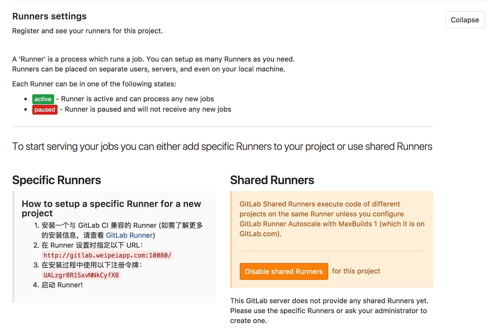
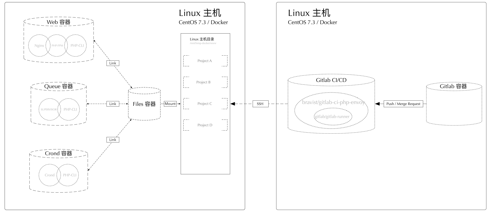

# 基于Docker快速搭建Gitlab与Gitlab CI/CD服务

此文档基于现有项目运行实践整理，其中包含了许多Gitlab、CI/CD相关概念，阅读需要有一定的Gitlab、Docker、CI/CD基础知识。

## 目录
* [横线](#横线)
* [此项目能做什么](##此项目能做什么)
​* [Git Flow / Github Flow /Gitlab Flow Git工作流](##Git Flow/ Github Flow /Gitlab Flow Git工作流)
​* [快速运行Gitlab](##快速运行Gitlab)
​* [持续集成/持续交互（CI/CD） ](##持续集成/持续交互（CI/CD） )
​* [Gitlab Runner - 自动构建与部署的执行](##Gitlab Runner - 自动构建与部署的执行)
​   * [1. 获取注册参数 ](###1. 获取注册参数 )
​   * [2. 为项目注册一个Shell 类型的Gitlab Runner ](###2. 为项目注册一个Shell 类型的Gitlab Runner )
​* [Gitlab CI/CD运行流程](##Gitlab CI/CD运行流程)
​* [Gitlab CI/CD 分布式构建参考](##Gitlab CI/CD 分布式构建参考)


## 此项目能做什么

1. 分享一些关于团队Git版本控制使用心得。
2. 提供一份Docker版本的Gtilab私有化仓库应用实现，让你在开发团队内部快速构建一套Git托管仓库系统。
3. 提供一份Gitlab Docker容器编排实现参考，分离Gitlab/Redis/PostgreSQL/Gitlab-CI和运行时数据。
4. 提供一份Gitlab Runner Docker版本实现，在Runner容器内部增加了对PHP的支持，利用[Laravel Envoy](https://github.com/laravel/envoy)实现远程操作多台主机，实现分布式自动构建与交付。
5. 加深对软件从编码 =》 构建 =》 测试 =》 部署的整个生命周期的认知，
6. 为Web/Web API类型互联网产品自动化提供参考，适合中小型创业研发团队快速迭代版本。

## Git Flow / Github Flow /Gitlab Flow Git工作流

Git团队开发中，大家都在向仓库中提交功能代码，时间久了，分支与版本就逐渐增多而变得复杂，因此，一个合理的版本管理流程在项目初期就非常重要。

使用Git，多数时候推荐流行的git-flow工作流程 [git-flow 备忘清单](https://danielkummer.github.io/git-flow-cheatsheet/index.zh_CN.html)。通常，develop分支作为测试版本使用，所有开发者都能够向该分支合并代码，以保证代码经过评审和功能验证。master分支作为线上版本使用，只有仓库管理员才能向该分支合并代码，以确保线上版本稳定。


+ **feature branches**  功能特性分支，基于develop分支开发，在功能开发完成后，代码会被合并到develop分支，此分支也自动删除。
+ **develop** 测试分支，一般基于该分支构建应用的测试环境。
+ **release branches**  发布分支。新功能开发完成，经过了代码评审和功能验证后，仓库管理员使用`git flow release start 1.0.0` 命令方式合并develop分支到master分支。使用该命令，需要确保master分支与develop分支基础版本一致。
+ **hotfixes** 修复分支，一般而言，在线上环境出现问题，需要紧急修复时，需创建hotfix修复补丁分支，它基于master分支开发，补丁修复代码会被合并至master与develop分支。
+ **master** 生产分支，一般基于该分支中构建应用的生产环境。


在单人Git开发场景下，此流程足以满足需求，但是在多人的开发团队中，有时候稍显"[无力](https://about.gitlab.com/2014/09/29/gitlab-flow/)"，而Gitlab/Github推荐使用PR/MR的方式，开发者需要主动发起分支合并申请，在得到确认后，分支开发才算完成。

开发者基于主干分支先创建新的功能性分支，在功能开发完成后，需要作Merge Request申请，也即是主动请求合并功能分支代码到主干分支。仓库管理员会评审每一次MR，只有评审通过，新功能才被提交上线。


## 快速运行Gitlab

Gitlab提供社区与企业版本，[官网](https://about.gitlab.com/installation/)提供多种Gitlab安装方式。此项目是基于Docker版本的Gitlab实现，开发者无需更多关心Gitlab安装过程，Docker镜像已做好了环境和依赖。

该项目基于[Docker GitLab](http://www.damagehead.com/docker-gitlab/) 镜像构建，它将Gitlab/PostgreSQL/Redis容器拆分，分离了运行时数据。同时，提供一套容器编排配置参考，支持Docker Compose快速构建与维护。

确保你的主机已经安装好了Docker与Docke-Compose，按照下面的方式快速运行Gitlab。

1. 克隆仓库

   ```sh
   $ git clone https://github.com/bravist/gitlab-docker
   $ cd ~/gitlab-docker
   ```

2. 配置环境变量，推荐使用默认配置

   ```sh
   $ cp .env.example .env
   ```

3. 使用`docker-compose`构建镜像和启动容器

   ```sh
   $ docker-compose build && docker-compose up -d
   ```

4. 确认容器构建成功，Gitlab Web控制台访问：[http://localhost:10080/](http://localhost:10080/)，如果出现502错误，请稍后再次访问，容器构建Gitlab需要等待依赖安装完成。

   ```bash
   CONTAINER ID        IMAGE                             COMMAND                  CREATED             STATUS              PORTS                                                   NAMES
   8827363f45d8        sameersbn/gitlab:10.3.3           "/sbin/entrypoint.sh…"   4 seconds ago       Up 4 seconds        443/tcp, 0.0.0.0:10022->22/tcp, 0.0.0.0:10080->80/tcp   gitlabdocker_gitlab_1
   db0dd3b3d23f        bravist/gitlab-ci-php-envoy:1.0   "/usr/bin/dumb-init …"   7 seconds ago       Up 6 seconds                                                                gitlab-ci-php-envoy-runner
   f598844c561c        sameersbn/redis:latest            "/sbin/entrypoint.sh…"   7 seconds ago       Up 6 seconds        6379/tcp                                                gitlab-redis
   73d93b7cd110        sameersbn/postgresql:9.6-2        "/sbin/entrypoint.sh"    7 seconds ago       Up 5 seconds        0.0.0.0:5432->5432/tcp                                  gitlab-postgresql
   ```
项目内置了Gitlab Runner镜像，默认会启动一台Gitlab Runner容器，让你在本地可以快速搭建CI/CD服务。

## 持续集成/持续交互（CI/CD） 

CI/CD 的全称是 Continuous Integration & Deployment (持续集成/部署)，是 extreme programming (极限编程) 的一部分。我们常用 CI 来做一些自动化工作，这种自动化工作会运行在一台集中的机器上，比如程序的打包，单元测试，部署等。 [维基百科  - 持续集成](https://zh.wikipedia.org/wiki/%E6%8C%81%E7%BA%8C%E6%95%B4%E5%90%88)


Gitlab 从8.*版本后支持CI/CD，要使用CI/CD，先理解一些概念

**Pipeline**

一次[Pipeline](https://docs.gitlab.com/ce/ci/pipelines.html)就是一次完整的构建任务，里面可以包含多个阶段（[stages](https://docs.gitlab.com/ce/ci/yaml/README.html#stages)）。

**Stage** 

Stages表示任务构建的阶段。一次Pipeline中允许定义多个 Stages，这些 Stages 会有以下特点：

- 所有 Stages 会按照顺序运行，即当一个 Stage 完成后，下一个 Stage 才会开始
- 只有当所有 Stages 完成后，该构建任务 (Pipeline) 才会成功
- 如果任何一个 Stage 失败，那么后面的 Stages 不会执行，该构建任务 (Pipeline) 失败

**Job**

Jobs 表示构建工作，表示某个 Stage 里面执行的工作。
我们可以在 Stages 里面定义多个 Jobs，这些 Jobs 会有以下特点：

- 相同Stage中的Jobs会并行执行
- 相同Stage中的Jobs都执行成功时，该 Stage 才会成功
- 如果任何一个Job失败，那么该 Stage 失败，即该构建任务 (Pipeline) 失败

我把[Pipelines](https://docs.gitlab.com/ce/ci/pipelines.html)理解为流水线，流水线包含有多个阶段（[stages](https://docs.gitlab.com/ce/ci/yaml/README.html#stages)），每个阶段包含有一个或多个工序（[jobs](https://docs.gitlab.com/ce/ci/yaml/README.html#jobs)），比如先购料、组装、测试、包装再上线销售，每一次Push或者MR都要经过流水线之后才可以合格出厂。


Gilab中，仓库的.gitlab.ci.yml文件负责定义项目具体工作任务和流水线，Gitlab Runner基于配置好的流水线逐步执行任务，直到任务完成，如果中途错误，它会立即停止后续的任务。如果项目使用Gitlab CI，需要提前添加该文件。

```shell
stages:
  - pull_code_test
  - pull_code_production
  - install_deps
  - test
  - build
  - deploy_test
  - deploy_production
variables:
  PHP_FPM_CONTAINER: lnmp-php-fpm
  WORK_DIR: /usr/share/nginx/html/
  PROJECT: laravel-demo
  GIT_DIR: /mnt/lnmp-docker
# 拉取代码
pull_code_test: 
  stage: pull_code_test
  only: 
    - develop
  script: 
     - cd ${GIT_DIR}/${PROJECT}
     - git pull origin develop
pull_code_production:
  stage: pull_code_production
  only:
    - master
  script: 
    - cd ${GIT_DIR}/${PROJECT}
    - git pull origin master
# 安装依赖
install_deps:
  stage: install_deps
  script: 
    - docker exec -w ${WORK_DIR}/${PROJECT} ${PHP_FPM_CONTAINER} composer install
build: 
  stage: build
  script: 
    # Run migrations
    - docker exec -w ${WORK_DIR}/${PROJECT} ${PHP_FPM_CONTAINER} php artisan migrate
    # Cache clearing
    - docker exec -w ${WORK_DIR}/${PROJECT} ${PHP_FPM_CONTAINER} php artisan cache:clear
    # Create a cache file for faster configuration loading
    - docker exec -w ${WORK_DIR}/${PROJECT} ${PHP_FPM_CONTAINER} php artisan config:cache
    # Create a route cache file for faster route registration
    - docker exec -w ${WORK_DIR}/${PROJECT} ${PHP_FPM_CONTAINER} php artisan route:clear
deploy_test: 
  stage: deploy_test
  script:
    - cd ${GIT_DIR}
    - docker-compose down && docker-compose build && docker-compose up -d
deploy_production: 
  stage: deploy_production
  script:
    - cd ${GIT_DIR}
    - docker-compose restart
```


## Gitlab Runner - 自动构建与部署的执行

GitLab Runner 是一个开源项目， 它用来运行你定制的任务（jobs）并把结果返回给 GitLab。 GitLab Runner 配合[GitLab CI](https://about.gitlab.com/gitlab-ci)（GitLab 内置的持续集成服务） 协调完成任务。 [GitLab Runner](https://docs.gitlab.com.cn/runner/)

简单的说，Gitlab Runner是独立运行配置好了Gitlab CI/CD项目的机器，它负责Gitlab项目的自动构建和部署的运行。

Gitlab Runner安装有多种方式，具体可以参考[官方文档](https://docs.gitlab.com.cn/runner/install/index.html)，这里推荐使用基于Docker的版本 [bravist/gitlab-ci-php-envoy](https://hub.docker.com/r/bravist/gitlab-ci-php-envoy/)，镜像源码已同步在此项目中，上面的章节也能看到运行的容器。

Gitlab Runner安装运行之后，需要[注册到Gitlab项目中去](https://docs.gitlab.com.cn/runner/register/index.html)，才能使用其“功效”。

### 1. 获取注册参数 

登录Gitlab控制台，选择一个Gitlab仓库，进入 Settings =》CI / CD =》Runners settings =》Expand，获取Runners相关参数。



### 2. 为项目注册一个Shell 类型的Gitlab Runner 

```shell
$ docker exec -it gitlab-ci-php-envoy-runner gitlab-ci-multi-runner register

Running in system-mode.

#输入CI URL
Please enter the gitlab-ci coordinator URL (e.g. https://gitlab.com/):
http://gitlab.weipeiapp.com:10080/

#输入CI Token
Please enter the gitlab-ci token for this runner:
eU9zcqjReSozw6a1RLL8

#输入描述信息
Please enter the gitlab-ci description for this runner:
[f6c7de92c743]: Gitlab CI usage

#输入标签信息
Please enter the gitlab-ci tags for this runner (comma separated):
v1.0

#是否运行未标记的版本
Whether to run untagged builds [true/false]:
[false]: true

#是否运行当前项目
Whether to lock the Runner to current project [true/false]:
[true]: true

Registering runner... succeeded                     runner=eU9zcqjR

#输入Runner的类型 
Please enter the executor: shell, virtualbox, docker-ssh+machine, kubernetes, docker, docker-ssh, parallels, ssh, docker+machine:
shell

Runner registered successfully. Feel free to start it, but if it's running already the config should be automatically reloaded!
```

注册成功后，页面会多出一个正在运行的Runner绿色标志。

## Gitlab CI/CD运行流程

如果你了解[bravist/lnmp-docker](https://github.com/bravist/lnmp-docker)，对于下面的图不会陌生，主要提供了一套Web应用自动构建与交付流程架构。

通常情况下Gitlab Runner与Gitlab无需运行在同一台服务器，他们之间通信基于授信TOKEN，整个运行流程是：

1. 基于Gitlab Flow 完成功能开发		
2. 提交Merge Request，等待功能发布申请
3. 评审Merge Request，允许合并分支请求
4. 触发Gitlab Runner运行
5. 执行项目 .gitlab.ci.yml 配置好的流水线任务
6. 完成CI/CD流水线工作，工作结束

以一个前端项目为例，构建过程会做以下任务

+ 拉取Git代码	
+ 安装前端依赖
+ 打包、编译



## Gitlab CI/CD 分布式构建参考

本项目Gitlab Runner默认采用Shell方式执行部署任务，也即是Runner使用SSH登录到应用主机。你可以在Runner容器中生成新的ssh秘钥对（或者使用能够登录到应用主机的其他ssh秘钥对），确保能成功SSH到应用主机。

进入到Runner容器

```shell
docker exec -it  gitlab-ci-php-envoy-runner sh
```

使用ssh登录远程应用主机

```shell
ssh root@47.*.*.69
```

如果成功登录，表示自动部署链接工作没有问题。如果你的应用部署了多台服务器，推荐使用[Larave Envoy](https://laravel.com/docs/5.6/envoy)部署任务。Laravel Envoy 基于PHP实现，提供了灵活的配置方便在应用主机构建任务。 [bravist/gitlab-ci-php-envoy](https://hub.docker.com/r/bravist/gitlab-ci-php-envoy/) Runner基于gitlab/gitlab-runner镜像，又增加了对PHP的支持，完全支持Laravel Envoy部署。

要使用Laravel Envoy，需要在仓库中增加Envoy.blade.php文件，定义好所有主机需要做的事情。

```shell
@servers(['sandbox' => 'root@47.*.*.45', 'production' => 'root@47.*.*.69'])

@story('sandbox_deploy', ['on' => ['sandbox']])
	git
	logistics-debt
@endstory

@story('production_deploy', ['on' => ['production']])
	git
	logistics-debt
@endstory


@task('git')
	cd /mnt/lnmp-docker/www/{{ $project }}/
	git config --global user.email "chenghuiyong1987@gmail.com"
	git config --global user.name "Gitlab Runner"
	git pull origin {{ $branch }}
@endtask
	
@task('logistics-debt')
	cd /mnt/lnmp-docker/www/{{ $project }}/logistics-debt
	cnpm install 
	npm run build
@endtask

```

同时，在仓库的.gitlab-ci.yml文件中定义使用Envoy执行构建任务。

```shell
stages:
  - sandbox
  - production
 
variables:
  ENVOY: /root/.composer/vendor/bin/envoy

sandbox:
   stage: sandbox
   script:
     - cd $CI_PROJECT_DIR
     - $ENVOY run sandbox_deploy --branch=develop --project=$CI_PROJECT_NAME
   only: 
    - develop
production: 
  stage: production
  script: 
     - cd $CI_PROJECT_DIR
     - $ENVOY run production_deploy --branch=master --project=$CI_PROJECT_NAME
  only:
    - master
```


